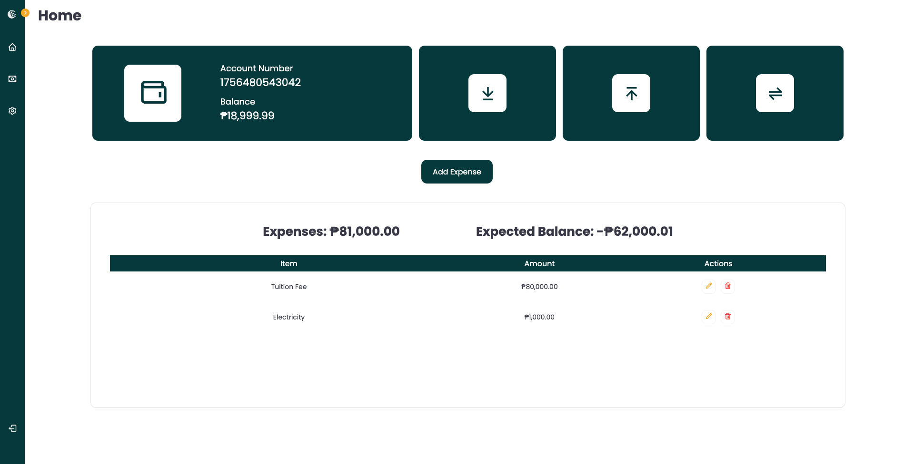

# banking-app

This project is a combination of Banking and Budget web application.

## Tech Stack

- HTML
- SCSS
- React

## Features

### Admin:

- Create, edit, and remove a user
- Withdraw, deposit, and transfer money from a user
- View all user transactions

## User:

- Create an account
- Withdraw, deposit, and transfer money
- Add, edit, and remove expenses
- View transactions

## Test Accounts

### Admin:

- `email: admin@email.com`  
  `password: admin`
  `balance: 15000.0`

### User:

- `email: jd@email.com`  
  `password: jd`
  `balance: 20000.0`

- `email: mdc@email.com`  
  `password: mdc`
  `balance: 30000.0`

- `email: jdc@email.com`  
  `password: jdc`
  `balance: 0.0`

### Live Demo: https://banking-app-kappa.vercel.app/
